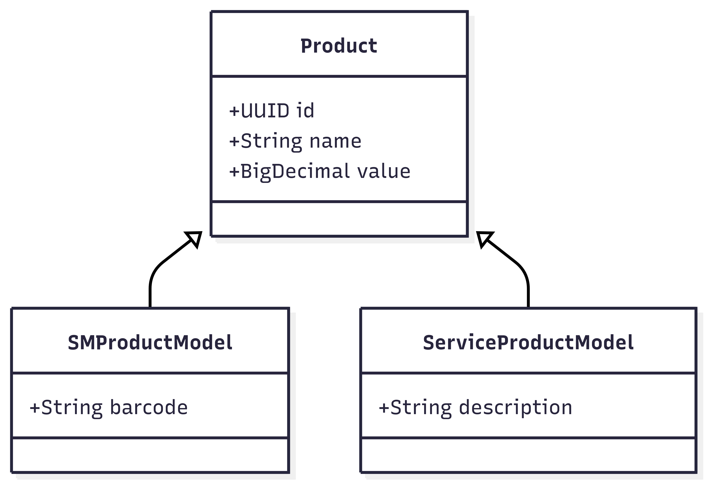

## 🧭 Visão Geral do Sistema de Produtos

Este sistema define uma estrutura base reutilizável para representar produtos, permitindo criar diferentes variações (como produtos de supermercado, serviços, veículos etc.) sem repetir código desnecessário.

---

### 🔧 Classe Base: `Product`

A classe `Product` é uma **classe abstrata** e marcada com `@MappedSuperclass`. Isso significa que:

- Ela **não é uma entidade JPA por si só**.
- Serve como base para outras entidades, **compartilhando campos comuns**.

Ela define os seguintes campos padrão:

| Campo   | Tipo       | Descrição                                                 |
|---------|------------|------------------------------------------------------------|
| `id`    | UUID       | Identificador único do produto.                            |
| `name`  | String     | Nome com o qual o produto será referenciado.               |
| `value` | BigDecimal | Valor monetário do produto. Armazenado com precisão (38,2).|

Além disso, possui um método `getProductValueAsString()` que retorna o valor formatado como texto.

---

### 📐 Regras para Criar um Novo Tipo de Produto

Sempre que for criar um novo tipo de produto, siga estas orientações:

1. **Estenda a classe `Product`**:
   ```java
   public class MeuProdutoModel extends Product {  }
   ```

2. **Marque a nova classe com `@Entity` e `@Table(...)`** para que seja reconhecida como entidade JPA.

3. **Implemente o número de série da classe manualmente**:
   ```java
   @Serial
   private static final long serialVersionUID = 1L;
   ```
   > ✅ Todas as classes que estendem `Product` devem declarar seu **próprio `serialVersionUID`**, mesmo herdando.

4. **Adicione os campos específicos do seu tipo de produto**, como `barcode`, `description`, `placa`, `serviço`, etc.

---

### ✅ Exemplo de Produto de Supermercado

```java
@Entity
@Table(name = "TB_PRODUCTS")
@NoArgsConstructor
public class SMProductModel extends Product {

    @Serial
    private static final long serialVersionUID = 1L;

    @Column(name = "bar_code")
    @Getter
    private String barcode;

    public SMProductModel(String name, double value, String barcode) {
        super(name, value);
        this.barcode = barcode;
    }
}
```

---

### 📌 Observações Finais

- A classe `Product` define a **estrutura mínima obrigatória** para qualquer tipo de produto no sistema.
- Cada classe concreta (filha) é uma entidade independente no banco.
- O uso de `@MappedSuperclass` garante que os campos sejam herdados sem gerar tabelas duplicadas.
- Você pode usar essa estrutura para escalar facilmente o sistema com outros tipos de produto (como serviços, aluguéis, veículos etc.).

